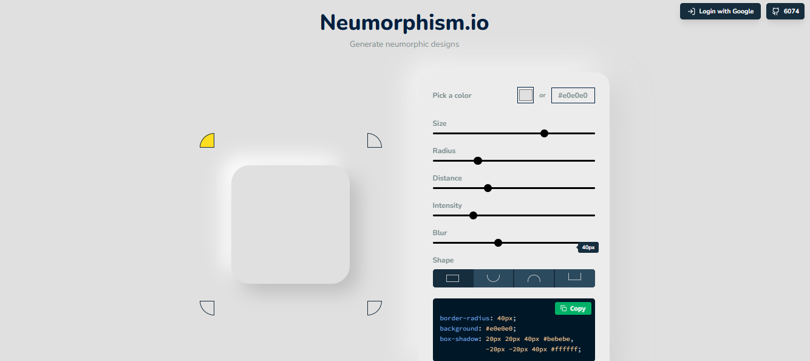
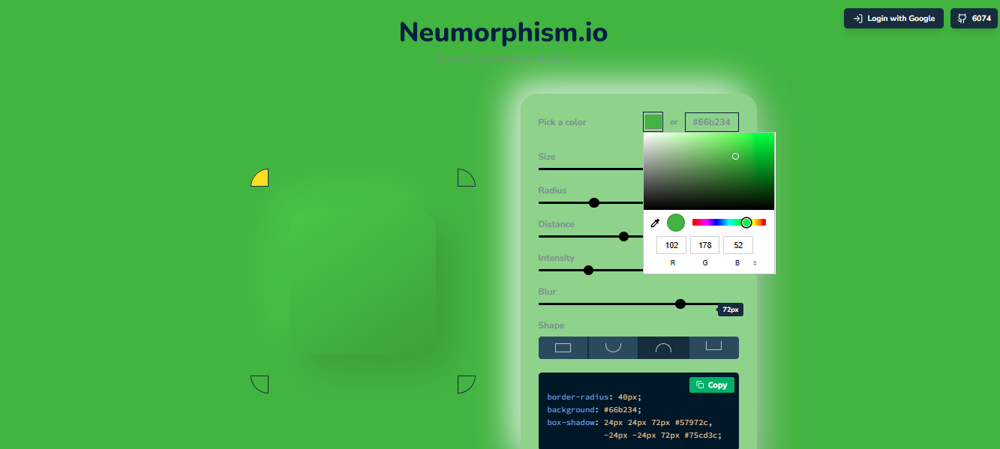
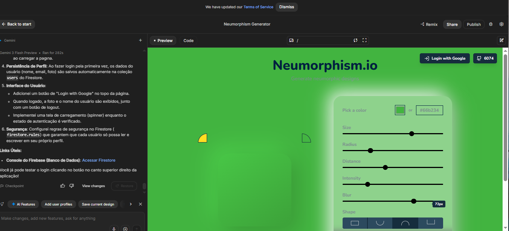
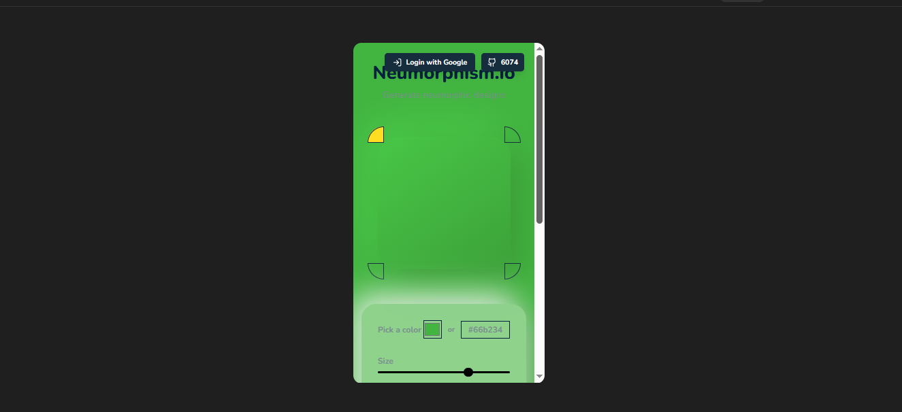

# 🚀 SM5 — Do Clone ao Produto Mínimo Viável (MVP+)

## 📝 Descrição do Projeto

O projeto **Morphly — Neumorphic Design Studio** foi desenvolvido com o objetivo de transformar a análise estrutural de produtos digitais existentes em um **Produto Mínimo Viável (MVP+) funcional**, aplicando princípios de engenharia de software assistida por Inteligência Artificial.

A proposta envolveu:

- engenharia reversa de interfaces;
- análise comparativa de usabilidade;
- refabricação de componentes;
- otimização estrutural de layout;
- adaptação de identidade visual;
- implementação incremental orientada a feedback.

O sistema foi construído utilizando IA como ferramenta de apoio para:

- prototipagem acelerada;
- geração assistida de código;
- refinamento de interface;
- validação de consistência visual;
- fidelidade de layout;
- automação parcial do fluxo de desenvolvimento.

O resultado final foi uma aplicação funcional hospedada no **Google AI Studio Apps**, apresentando diferenciais próprios em relação às referências analisadas, garantindo originalidade estrutural e independência estética.

---

# 🌐 Aplicação Final

## 🔗 Deploy do Projeto

[Morphly no Google AI Studio](https://ai.studio/apps/4b032df5-8aa0-4f9f-a5aa-fe0220b85297)

## 🔗 Repositório Oficial

[GitHub — Morphly Neumorphic Design Studio](https://github.com/bryanthomas-dev/Morphly---Neumorphic-Design-Studio)

---

# 🖼️ Estrutura Visual da Aplicação

## Capturas da Interface Final

### Tela Inicial

<p align="center">
  
</p>

### Editor de Componentes

<p align="center">
  
</p>

### Painel de Customização

<p align="center">
  
</p>

### Responsividade Mobile

<p align="center">
  
</p>

# 🧠 Arquitetura do Projeto

```txt
📁 morphly/
│
├── index.html
├── style.css
├── script.js
├── README.md
│
├── assets/
│   ├── screenshots/
│   ├── icons/
│   └── previews/
│
└── components/
    ├── cards/
    ├── buttons/
    ├── inputs/
    └── neumorphism/
```

---

# ⚙️ Tecnologias Utilizadas

## Linguagens e Estrutura

- HTML5
- CSS3
- JavaScript ES6+

## Plataformas

- Google AI Studio
- Google AI Studio Apps

## Ferramentas de Apoio

- Claude AI
- GitHub
- VSCode

---

# 🧩 Engenharia da Interface

O projeto utilizou conceitos modernos de engenharia de front-end com foco em:

- design system modular;
- componentização reutilizável;
- consistência visual;
- fidelidade de layout;
- escalabilidade estrutural;
- experiência do usuário (UX).

## Estratégias Aplicadas

### 🔹 Refabricação de Componentes

Os elementos visuais foram reconstruídos utilizando uma abordagem de refatoração estrutural, evitando cópia direta de interfaces analisadas.

### 🔹 Otimização Estrutural

A organização do CSS e dos componentes buscou:

- reduzir redundâncias;
- melhorar manutenção;
- aumentar reutilização;
- simplificar estilização responsiva.

### 🔹 Fidelidade Visual

Foram preservados princípios modernos de interface:

- profundidade visual;
- sombras suaves;
- contraste equilibrado;
- consistência tipográfica;
- microinterações.

---

# 🧠 Processo de Desenvolvimento Assistido por IA

A Inteligência Artificial foi utilizada como suporte técnico em:

- geração de boilerplates;
- refinamento de código;
- prototipagem visual;
- aceleração de debugging;
- validação estrutural;
- melhoria iterativa de interface.

## Fluxo Aplicado

```txt
Análise → Engenharia Reversa → Refabricação →
Prototipagem → Refinamento → MVP Funcional
```

---

# 🔬 Reflexões Técnicas

## 👨‍💻 O Papel do Engenheiro no Cenário com IA

Com a consolidação do desenvolvimento assistido por IA, o engenheiro de software deixa de atuar apenas na implementação manual e passa a assumir funções de:

- arquiteto de solução;
- validador técnico;
- curador de qualidade;
- analista estrutural;
- engenheiro de prompts.

Nesse contexto, tornam-se essenciais competências como:

- abstração computacional;
- decomposição de problemas;
- modelagem lógica;
- comunicação técnica precisa;
- validação crítica de inferência.

A IA acelera a produção, porém a responsabilidade sobre:

- arquitetura;
- segurança;
- coerência;
- performance;
- originalidade

continua dependente da análise humana.

---

# ⚖️ Análise Técnica sobre Plágio e Originalidade

O uso de IA no desenvolvimento deixa de ser suporte legítimo quando ocorre:

- reprodução estrutural excessiva;
- replicação visual direta;
- reutilização não transformativa;
- apropriação de autoria.

Neste projeto, foi adotada a diretriz ética baseada em:

## 🔹 Transparência

Declaração explícita do uso de IA durante o desenvolvimento.

## 🔹 Transformação

Reconstrução dos componentes analisados utilizando:

- lógica própria;
- reorganização estrutural;
- adaptação visual;
- implementação independente.

---

# 📊 Resultados Obtidos

## Funcionalidades Entregues

- MVP funcional hospedado;
- Interface responsiva;
- Sistema visual neumórfico;
- Componentes reutilizáveis;
- Navegação fluida;
- Estrutura modular.

## Aprendizados Técnicos

- Iteração orientada a feedback;
- Engenharia de prompts aplicada a produto;
- Organização de arquitetura front-end;
- Refatoração de componentes;
- Fidelidade de layout com IA;
- Otimização estrutural de interface.

---

# 📈 Comparativo Técnico

| Aspecto | Resultado Obtido |
|---|---|
| Responsividade | Alta |
| Fidelidade Visual | Alta |
| Reutilização de Componentes | Média/Alta |
| Complexidade Estrutural | Média |
| Performance Visual | Alta |
| Originalidade | Validada |
| Escalabilidade | Média |

---

# 🚀 Execução do Projeto

## Passo 1 — Clonar Repositório

```bash
git clone https://github.com/bryanthomas-dev/Morphly---Neumorphic-Design-Studio.git
```

## Passo 2 — Entrar na Pasta

```bash
cd Morphly---Neumorphic-Design-Studio
```

## Passo 3 — Executar Projeto

Abra o arquivo:

```bash
index.html
```

ou utilize uma extensão como:

```txt
Live Server (VSCode)
```

---

# 🔙 Navegação

[⬅ Voltar ao Portfólio](https://github.com/bryanthomas-dev/portif-lio_Bryan_Thomas)

---

# 📄 Licença

Projeto acadêmico desenvolvido para fins educacionais e experimentais em Engenharia de Prompt e Aplicações em IA.
