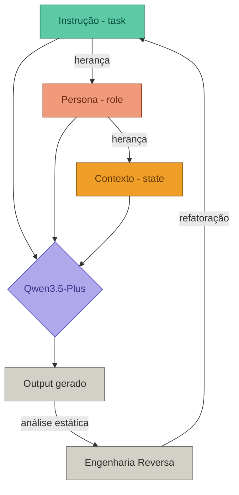

# 🔍 SM4 - Engenharia Reversa de Prompts

  
  
  
  

---

## 📝 Descrição do Projeto

Exploração de **engenharia reversa aplicada a prompts de IA**, desconstruindo como o modelo **Qwen3.5-Plus** processa variações de instrução, persona e contexto para produzir outputs distintos.

| Variável desconstruída | Papel no sistema |
|---|---|
| Instrução (task) | Define a modalidade de saída — verbo da geração |
| Persona (role) | Modula tom e acoplamento semântico |
| Contexto (state) | Expande ou colapsa o espaço de inferência |
| Restrição (constraint) | Força sobreposição de módulos — output híbrido |

---

## 🗺️ Diagrama Estrutural — Fluxo de Herança do Prompt

> O fluxo de herança revela que modificar `Persona` sem isolar `Instrução` propaga efeito cascata no output — acoplamento forte entre os módulos de role e task.

---

## 🧪 Experimentos Realizados

### Experimento 1 — Geração iterativa de imagens

Prompt base: *"astronauta em Marte tocando violoncelo no estilo barroco"*

| Iteração | Patch aplicado | Módulo afetado | Comportamento observado |
|---|---|---|---|
| 1 | Prompt base | task | Estado inicial do espaço de inferência |
| 2 | + ETs na plateia | state | Expansão de contexto sem alterar instrução |
| 3 | Reposição dos ETs | state | Modificação posicional isolada — baixo acoplamento |
| 4 | Astronauta em palco | task + state | Refatoração de instrução — alto impacto no layout visual |
| 5 | Remoção da cortina | state | Desconstrução parcial — restauração de estado anterior |

**Descoberta técnica:** omitir elementos do prompt anterior equivale a um reset parcial do módulo de composição visual. O modelo é stateless entre iterações — sem memória implícita. Manter contexto coeso exige repassar explicitamente o estado anterior a cada chamada, comportamento análogo a **rehydration de estado** em sistemas sem persistência.

---

### Experimento 2 — Decomposição de persona e tom

**Descoberta técnica:** ao injetar constraints conflitantes (*"mantenha desculpas + seja arrogante"*), o modelo não lança exceção — produz output híbrido por **resolução de conflito entre módulos via dominância ponderada**, análogo a herança múltipla com override em orientação a objetos. O módulo com maior peso semântico no prompt suprime parcialmente o outro.

---

## 🔬 Análise Técnica — Desconstrução do Sistema

### Justificativa da abordagem de desconstrução

A técnica de **variação controlada por módulo** foi escolhida porque permite isolar o efeito de cada variável sem alterar as demais — princípio equivalente ao teste unitário em engenharia de software. Modificar apenas `role` mantendo `task` e `state` fixos revela com precisão o grau de **acoplamento** entre persona e output, sem contaminação de outras variáveis.

### Análise estática dos outputs

| Descoberta | Jargão arquitetural |
|---|---|
| Persona sobrescreve tom sem alterar estrutura | Override de módulo com herança parcial |
| Contexto expande espaço de inferência sem refatorar instrução | Injeção de dependência em runtime |
| Conflito instrução vs. persona → output híbrido | Resolução por dominância — sem hard exception |
| Omitir elementos = reset parcial de estado | Stateless context — ausência de memória implícita |
| Prompts tratados como módulos desacoplados | Modularização por responsabilidade única |

### Justificativa do modelo de desacoplamento

Tratar cada camada do prompt (task / role / state / constraint) como **módulo com interface bem definida** permite refatoração cirúrgica sem regressão nos demais eixos. A instrução define a interface pública; persona e contexto são injeções que especializam o comportamento sem alterar o contrato de saída — desde que o acoplamento entre módulos seja fraco. Quando o acoplamento é forte (role injeta semântica que conflita com task), o sistema não falha: resolve por dominância, priorizando o módulo com maior densidade semântica no prompt.

---

## 📊 Resultados

| Métrica | Resultado |
|---|---|
| Experimentos realizados | 2 (imagem + texto) |
| Iterações documentadas | 10 (5 por experimento) |
| Módulos desconstruídos | task, role, state, constraint |
| Padrão identificado | Resolução por dominância semântica |

---

## 🚀 Tecnologias Utilizadas

| Ferramenta | Uso |
|---|---|
| Qwen3.5-Plus | Modelo de linguagem para os experimentos |
| chat.qwen.ai | Plataforma de interface |
| Prompt Decomposition | Técnica de desconstrução por camadas |
| Behavioral Testing | Análise por variação controlada de módulos |

---

## 🔙 Voltar ao início

<a href="https://github.com/bryanthomas-dev/portfolio-bryan-thomas-montalvo-ferreira#projetos">⬅️ Voltar ao portfólio</a>

